# AWS Infrastructure Automation with Terraform

A reusable Terraform module library (VPC, EC2, IAM, S3, CloudWatch) deployed
across separate `dev` and `prod` environments, backed by S3 remote state with
DynamoDB locking, a supplementary CloudFormation stack, a Python
compliance/reporting script, and a GitHub Actions CI/CD pipeline that plans
on every PR and applies to prod only behind a manual approval gate.

This README is written as a **complete runbook** — every command that was
actually run, every real output, every bug hit and how it was fixed, and
every screenshot proving it's real. Read it top to bottom and you (or anyone
else) can rebuild this entire project from zero.

---

## Table of Contents

1. [Architecture](#architecture)
2. [Repo Layout](#repo-layout)
3. [Prerequisites](#prerequisites)
4. [Part 1 — AWS CLI Setup](#part-1--aws-cli-setup)
5. [Part 2 — Remote State Backend](#part-2--remote-state-backend)
6. [Part 3 — Fix the Code, Point It at Your Account](#part-3--fix-the-code-point-it-at-your-account)
7. [Part 4 — Deploy Dev](#part-4--deploy-dev)
8. [Part 5 — CloudWatch Alarms + SNS](#part-5--cloudwatch-alarms--sns)
9. [Part 6 — CloudFormation Supplementary Stack](#part-6--cloudformation-supplementary-stack)
10. [Part 7 — Python Infra Reporting Script](#part-7--python-infra-reporting-script)
11. [Part 8 — Push to GitHub](#part-8--push-to-github)
12. [Part 9 — GitHub OIDC + IAM Role for CI/CD](#part-9--github-oidc--iam-role-for-cicd)
13. [Part 10 — GitHub Environment Approval Gate](#part-10--github-environment-approval-gate)
14. [Part 11 — First Pipeline Run (and the Bugs We Hit)](#part-11--first-pipeline-run-and-the-bugs-we-hit)
15. [Part 12 — Successful End-to-End Pipeline Run](#part-12--successful-end-to-end-pipeline-run)
16. [Part 13 — Proof / Screenshots](#part-13--proof--screenshots)
17. [Part 14 — Full Teardown (Zero Cost)](#part-14--full-teardown-zero-cost)
18. [Interview Talking Points](#interview-talking-points)
19. [How to Redeploy From Scratch (Quick Reference)](#how-to-redeploy-from-scratch-quick-reference)

---

## Architecture

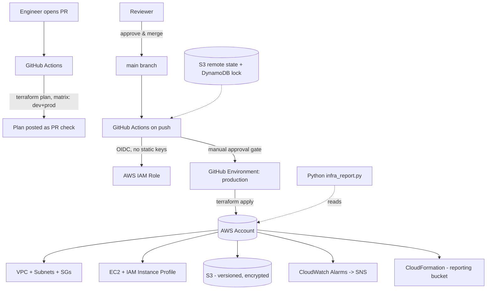

**Design decisions:**
- **Remote state with locking** — S3 backend + DynamoDB lock table prevents two people/pipelines running `apply` concurrently and corrupting state.
- **Environment isolation** — `environments/dev` and `environments/prod` are separate root modules with separate state files, both consuming the same versioned modules.
- **Reusable modules** — `vpc`, `ec2`, `iam`, `s3`, `cloudwatch` are generic and parameterized.
- **Least privilege by default** — S3 buckets block all public access and are encrypted at rest; EC2 uses IMDSv2 only.
- **CI/CD gate for infra changes** — `plan` runs on every PR (visible before merge); `apply` only runs on `main` and behind a GitHub Environment manual-approval gate for prod.
- **No static AWS keys in CI** — GitHub Actions assumes an IAM role via OIDC.

---

## Repo Layout

```
modules/
  vpc/            VPC, subnets, IGW, route tables, security group
  ec2/            EC2 instance with IMDSv2 enforced
  iam/            IAM role + instance profile
  s3/              S3 bucket with versioning, encryption, public-access-block
  cloudwatch/      CPU + status-check alarms
environments/
  dev/main.tf      Root module for dev
  prod/main.tf     Root module for prod
cloudformation/
  reporting-bucket.yaml   Supplementary stack, managed outside Terraform
scripts/
  infra_report.py  Python boto3 script — EC2 state + S3 security posture report
.github/workflows/
  terraform.yml    plan (PR, matrix dev+prod) -> apply (main, gated)
docs/
  ARCHITECTURE.md
  STEPS.md
screenshots/        Proof screenshots referenced in this README
```

---

## Prerequisites

| Tool | Version used | Check with |
|---|---|---|
| AWS CLI | 2.28.16 | `aws --version` |
| Terraform | any 1.6+ | `terraform version` |
| Git Bash (Windows) | — | ships with Git for Windows |
| An AWS account | — | with an IAM user, **not root** |

---

## Part 1 — AWS CLI Setup

### 1.1 Check AWS CLI is installed
```bash
aws --version
```
```
aws-cli/2.28.16 Python/3.13.7 Windows/11 exe/AMD64
```

### 1.2 Create an IAM user (console steps, not CLI)
1. AWS Console → IAM → Users → **Create user**
2. Name: `ujjwal-terraform-admin` — **do not** enable console access
3. Attach policy directly: `AdministratorAccess` (start broad, tighten later)
4. Create user → Security credentials tab → **Create access key** → choose **CLI** → download the `.csv`

> Starting with `AdministratorAccess` and scoping down later is a legitimate, common real-world pattern — worth stating plainly in an interview rather than pretending it was least-privilege from minute one.

### 1.3 Configure the CLI
```bash
aws configure
```
```
AWS Access Key ID [None]: <from CSV>
AWS Secret Access Key [None]: <from CSV>
Default region name [None]: ap-south-1
Default output format [None]: json
```

### 1.4 Verify
```bash
aws sts get-caller-identity
```
```json
{
    "UserId": "AIDAYX67LJBD4JAWU2A6T",
    "Account": "601226954823",
    "Arn": "arn:aws:iam::601226954823:user/ujjwal-terraform-admin2671"
}
```

---

## Part 2 — Remote State Backend

Terraform needs somewhere to store its state file safely (S3) with a lock
(DynamoDB) so two applies can never collide.

```bash
aws s3api create-bucket --bucket ujjwal-tf-state-601226954823 --region ap-south-1 --create-bucket-configuration LocationConstraint=ap-south-1
```
```json
{
    "Location": "http://ujjwal-tf-state-601226954823.s3.amazonaws.com/",
    "BucketArn": "arn:aws:s3:::ujjwal-tf-state-601226954823"
}
```

```bash
aws s3api put-bucket-versioning --bucket ujjwal-tf-state-601226954823 --versioning-configuration Status=Enabled
```

```bash
aws dynamodb create-table --table-name terraform-locks --attribute-definitions AttributeName=LockID,AttributeType=S --key-schema AttributeName=LockID,KeyType=HASH --billing-mode PAY_PER_REQUEST --region ap-south-1
```
Returns `"TableStatus": "CREATING"` — takes ~30-60s to go `ACTIVE`; Terraform will wait if needed.

> Bucket names must be **globally unique across all of AWS** — we baked the AWS account ID into the name to guarantee that.

---

## Part 3 — Fix the Code, Point It at Your Account

### 3.1 Replace placeholders with real values
```bash
sed -i 's/REPLACE-WITH-YOUR-STATE-BUCKET/ujjwal-tf-state-601226954823/' environments/dev/main.tf environments/prod/main.tf
sed -i 's/REPLACE-UNIQUE-SUFFIX/601226954823/' environments/dev/main.tf environments/prod/main.tf
```

### 3.2 Verify a current AMI exists (the original hardcoded AMI was deprecated)
```bash
aws ec2 describe-images --image-ids ami-0f5ee92e2d63afc18 --region ap-south-1
```
Result: this returned an **Ubuntu 22.04** image (not Amazon Linux as assumed), and it was **deprecated** as of May 2025. Fetched a current one instead:

```bash
aws ec2 describe-images --owners amazon --filters "Name=name,Values=al2023-ami-*-x86_64" "Name=state,Values=available" --region ap-south-1 --query "sort_by(Images, &CreationDate)[-1].[ImageId,Name]" --output text
```
```
ami-08e8e63035c905918   al2023-ami-minimal-2023.12.20260724.0-kernel-6.18-x86_64
```

```bash
sed -i 's/ami-0f5ee92e2d63afc18/ami-08e8e63035c905918/' environments/dev/main.tf environments/prod/main.tf
```

### 3.3 Bug #1 — invalid HCL: multiple arguments on one line

`terraform init` failed with:
```
Error: Invalid single-argument block definition
  on ..\..\modules\vpc\main.tf line 53, in resource "aws_security_group" "web":
  53:   ingress { from_port = 443, to_port = 443, protocol = "tcp", cidr_blocks = ["0.0.0.0/0"] }
```
**Root cause:** HCL only allows one argument per line inside a block — comma-separating multiple arguments on a single `ingress { }` line isn't valid syntax.

**Fix** — rewrote each `ingress`/`egress` block one argument per line:
```hcl
resource "aws_security_group" "web" {
  name   = "${var.name}-web-sg"
  vpc_id = aws_vpc.this.id

  ingress {
    from_port   = 443
    to_port     = 443
    protocol    = "tcp"
    cidr_blocks = ["0.0.0.0/0"]
  }
  ingress {
    from_port   = 80
    to_port     = 80
    protocol    = "tcp"
    cidr_blocks = ["0.0.0.0/0"]
  }
  egress {
    from_port   = 0
    to_port     = 0
    protocol    = "-1"
    cidr_blocks = ["0.0.0.0/0"]
  }
}
```

---

## Part 4 — Deploy Dev

```bash
cd environments/dev
terraform init
```
```
Terraform has been successfully initialized!
```

```bash
terraform plan -out tfplan
```
```
Plan: 18 to add, 0 to change, 0 to destroy.
```

```bash
terraform apply tfplan
```
```
Apply complete! Resources: 18 added, 0 changed, 0 destroyed.

Outputs:
bucket_id = "dev-infra-app-artifacts-601226954823"
vpc_id = "vpc-03ac02a0fa2a2b741"
web_ip = "10.10.0.15"
```

**Resources created:** VPC (`vpc-03ac02a0fa2a2b741`, 10.10.0.0/16) with 2 public + 2 private subnets, EC2 `dev-web` (t3.micro, `10.10.0.15`), S3 bucket `dev-infra-app-artifacts-601226954823` (versioned, encrypted, public access blocked), IAM role `dev-infra-role`.

---

## Part 5 — CloudWatch Alarms + SNS

The `cloudwatch` module existed in the library but wasn't wired up. Added to `environments/dev/main.tf`:

```hcl
resource "aws_sns_topic" "alerts" {
  name = "dev-infra-alerts"
}

module "cloudwatch_alarms" {
  source              = "../../modules/cloudwatch"
  instance_id         = module.web_server.instance_id
  alarm_sns_topic_arn = aws_sns_topic.alerts.arn
}

output "sns_topic_arn" { value = aws_sns_topic.alerts.arn }
```

```bash
terraform init
terraform plan -out tfplan
```
```
Plan: 3 to add, 0 to change, 0 to destroy.
```

```bash
terraform apply tfplan
```
```
Apply complete! Resources: 3 added, 0 changed, 0 destroyed.
Outputs:
sns_topic_arn = "arn:aws:sns:ap-south-1:601226954823:dev-infra-alerts"
```

Both alarms (`high-cpu-i-0097addd8672d8d84`, `status-check-failed-i-0097addd8672d8d84`) showed **OK** in the CloudWatch console:

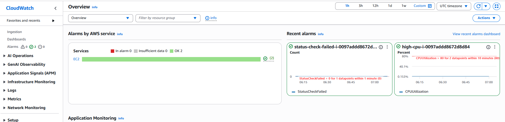

---

## Part 6 — CloudFormation Supplementary Stack

A small stack managed independently of Terraform — a reporting/log-export bucket, the kind of thing an ops/security team might own separately in a real org.

`cloudformation/reporting-bucket.yaml`:
```yaml
AWSTemplateFormatVersion: "2010-09-09"
Description: Supplementary CloudFormation stack - reporting/log export bucket, managed independently of the main Terraform stack

Parameters:
  EnvironmentName:
    Type: String
    Default: dev

Resources:
  ReportingBucket:
    Type: AWS::S3::Bucket
    Properties:
      BucketName: !Sub "${EnvironmentName}-infra-reports-${AWS::AccountId}"
      VersioningConfiguration:
        Status: Enabled
      BucketEncryption:
        ServerSideEncryptionConfiguration:
          - ServerSideEncryptionByDefault:
              SSEAlgorithm: AES256
      PublicAccessBlockConfiguration:
        BlockPublicAcls: true
        BlockPublicPolicy: true
        IgnorePublicAcls: true
        RestrictPublicBuckets: true
      LifecycleConfiguration:
        Rules:
          - Id: ExpireOldReports
            Status: Enabled
            ExpirationInDays: 90

Outputs:
  ReportingBucketName:
    Value: !Ref ReportingBucket
```

```bash
aws cloudformation create-stack --stack-name dev-infra-reporting --template-body file://cloudformation/reporting-bucket.yaml --parameters ParameterKey=EnvironmentName,ParameterValue=dev --region ap-south-1
aws cloudformation describe-stacks --stack-name dev-infra-reporting --region ap-south-1 --query "Stacks[0].StackStatus" --output text
```
```
CREATE_COMPLETE
```

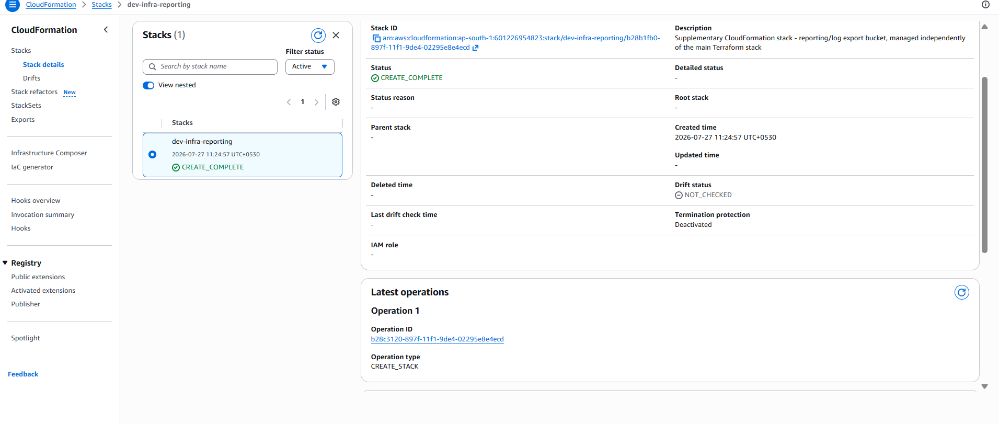

---

## Part 7 — Python Infra Reporting Script

`scripts/infra_report.py` — a real boto3 script reporting EC2 instance state and S3 bucket security posture (encryption + public-access-block status) across the account.

```bash
pip install boto3
python scripts/infra_report.py --region ap-south-1
```
```
Infra report - region=ap-south-1 - generated 2026-07-27T06:03:35Z

=== EC2 Instances ===
  Zomato Server        i-08d313d76fe336d27    stopped    m7i-flex.large uptime=612.6h
  Monitoring Server    i-0e37c8fbd89ac481a    stopped    m7i-flex.large uptime=611.9h
  dev-web              i-0097addd8672d8d84    running    t3.micro   uptime=1.1h

=== S3 Buckets - Security Posture ===
  dev-infra-app-artifacts-601226954823          encrypted=True   public_blocked=True   [OK]
  dev-infra-reports-601226954823                encrypted=True   public_blocked=True   [OK]
  ujjwal-tf-state-601226954823                   encrypted=True   public_blocked=True   [OK]
```

The full script source is in `scripts/infra_report.py` in this repo. This is a genuinely reusable compliance check — flags any bucket missing encryption or with public access enabled.

---

## Part 8 — Push to GitHub

```bash
git init
```

`.gitignore` (critical — keeps state files, provider binaries, and secrets out of version control):
```
.terraform/
*.tfstate
*.tfstate.backup
tfplan
*.tfvars
__pycache__/
*.pyc
github-trust-policy.json
```
> Note: `.terraform.lock.hcl` is deliberately **not** ignored — it pins the exact provider version so `terraform init` is reproducible for anyone who clones the repo.

```bash
git add .
git commit -m "Initial commit: Terraform AWS infra automation project"
git remote add origin https://github.com/ujjwalSharma267/Terraform-AWS-Infra.git
git branch -M main
git push -u origin main
```

---

## Part 9 — GitHub OIDC + IAM Role for CI/CD

No static AWS keys in GitHub secrets — GitHub Actions authenticates via OpenID Connect.

### 9.1 Get GitHub's real TLS thumbprint
```bash
echo | openssl s_client -servername token.actions.githubusercontent.com -showcerts -connect token.actions.githubusercontent.com:443 2>/dev/null | openssl x509 -fingerprint -noout -sha1 | sed 's/SHA1 Fingerprint=//;s/://g' | tr 'A-Z' 'a-z'
```
```
227203b5317f3818cab5b5ce596132bf36748c0e
```

### 9.2 Create the OIDC provider
```bash
aws iam create-open-id-connect-provider \
  --url https://token.actions.githubusercontent.com \
  --client-id-list sts.amazonaws.com \
  --thumbprint-list 227203b5317f3818cab5b5ce596132bf36748c0e
```
```json
{ "OpenIDConnectProviderArn": "arn:aws:iam::601226954823:oidc-provider/token.actions.githubusercontent.com" }
```

### 9.3 First attempt at a trust policy (this failed later — see Part 11)
```bash
cat > github-trust-policy.json << 'EOF'
{
  "Version": "2012-10-17",
  "Statement": [{
    "Effect": "Allow",
    "Principal": { "Federated": "arn:aws:iam::601226954823:oidc-provider/token.actions.githubusercontent.com" },
    "Action": "sts:AssumeRoleWithWebIdentity",
    "Condition": {
      "StringEquals": { "token.actions.githubusercontent.com:aud": "sts.amazonaws.com" },
      "StringLike": { "token.actions.githubusercontent.com:sub": "repo:ujjwalSharma267/Terraform-AWS-Infra:*" }
    }
  }]
}
EOF

aws iam create-role --role-name github-actions-terraform --assume-role-policy-document file://github-trust-policy.json
aws iam attach-role-policy --role-name github-actions-terraform --policy-arn arn:aws:iam::aws:policy/AdministratorAccess
```
Role created: `arn:aws:iam::601226954823:role/github-actions-terraform`

### 9.4 Wire the role ARN into the workflow
```bash
sed -i 's/ACCOUNT_ID/601226954823/g' .github/workflows/terraform.yml
```

---

## Part 10 — GitHub Environment Approval Gate

This is what actually enforces "plan-review gates eliminating ad-hoc manual production changes."

1. Repo → **Settings** → **Environments** → **New environment**
2. Name it exactly `production` (must match `environment: production` in the workflow)
3. Check **Required reviewers** → add yourself
4. **Save protection rules**

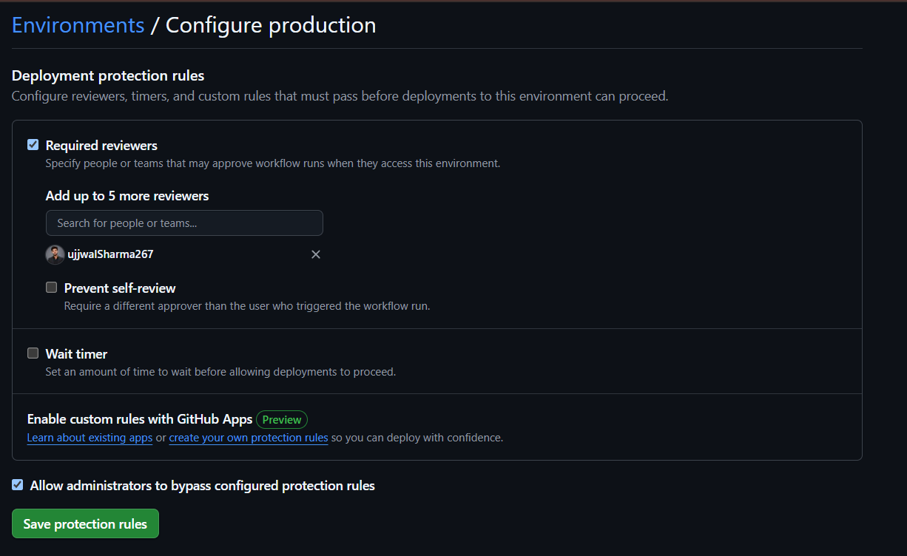

Result: even after a merge to `main`, the `apply` job pauses and waits for manual approval before touching AWS.

---

## Part 11 — First Pipeline Run (and the Bugs We Hit)

This is the most valuable section for interviews — real bugs, root-caused and fixed.

### Bug #2 — OIDC trust rejected: `Not authorized to perform sts:AssumeRoleWithWebIdentity`

First PR run failed at "Configure AWS credentials via OIDC" with:
```
Error: Could not assume role with OIDC: Not authorized to perform sts:AssumeRoleWithWebIdentity
```

Checked the obvious suspects first — all came back clean:
- Only one OIDC provider registered (`aws iam list-open-id-connect-providers`)
- Workflow's `permissions: id-token: write` block was present and correctly indented
- IAM role's trust policy JSON matched what was intended
- Re-ran after waiting for IAM propagation — still failed identically

**Diagnosis step:** added a temporary debug step to the workflow to decode and print the actual OIDC token claims GitHub was sending:
```yaml
- name: Debug OIDC token claims
  run: |
    curl -sH "Authorization: bearer $ACTIONS_ID_TOKEN_REQUEST_TOKEN" \
      "$ACTIONS_ID_TOKEN_REQUEST_URL&audience=sts.amazonaws.com" \
      | jq -r '.value' | cut -d '.' -f2 | base64 -d 2>/dev/null | jq '{sub, aud, repository, ref, event_name}'
```

Real output:
```json
{
  "sub": "repo:ujjwalSharma267@97116028/Terraform-AWS-Infra@1313477730:pull_request",
  "aud": "sts.amazonaws.com",
  "repository": "ujjwalSharma267/Terraform-AWS-Infra",
  "ref": "refs/pull/1/merge",
  "event_name": "pull_request"
}
```

**Root cause:** GitHub inserted `@97116028` and `@1313477730` into the `sub` claim — these are **immutable account/repo database IDs** that GitHub appends automatically (a protection against repo-rename hijacking of trust relationships). The original `StringLike` condition assumed the plain `owner/repo` format and silently failed to match.

**Fix:** match on the clean `repository` claim (exact match) combined with a wildcarded `sub` pattern (required by AWS — a trust policy must include a scoped `sub` or `job_workflow_ref` condition, it can't rely on `repository` alone):

```bash
cat > github-trust-policy.json << 'EOF'
{
  "Version": "2012-10-17",
  "Statement": [{
    "Effect": "Allow",
    "Principal": { "Federated": "arn:aws:iam::601226954823:oidc-provider/token.actions.githubusercontent.com" },
    "Action": "sts:AssumeRoleWithWebIdentity",
    "Condition": {
      "StringEquals": {
        "token.actions.githubusercontent.com:aud": "sts.amazonaws.com",
        "token.actions.githubusercontent.com:repository": "ujjwalSharma267/Terraform-AWS-Infra"
      },
      "StringLike": {
        "token.actions.githubusercontent.com:sub": "repo:ujjwalSharma267*/Terraform-AWS-Infra*:*"
      }
    }
  }]
}
EOF

aws iam update-assume-role-policy --role-name github-actions-terraform --policy-document file://github-trust-policy.json
```

First attempt at this fix actually failed with `MalformedPolicyDocument` because AWS requires the `sub`/`job_workflow_ref` condition to be present — you cannot drop it in favor of `repository` alone. The final policy above keeps both: the wildcard `sub` tolerates GitHub's ID-suffixed format, while the exact-match `repository` condition is what actually locks the trust down to this specific repo.

### Bug #3 — `terraform fmt -check` failing after debug-trigger cleanup

While retriggering test runs, appended raw `echo >>` lines directly into `.tf` files to force path-filter matches — this broke canonical formatting and failed the `fmt -check` gate:
```
Error: Terraform exited with code 3.
Error: The operation was canceled.
```

**Fix:**
```bash
sed -i '/# ci-debug-trigger/d' environments/dev/main.tf
cd environments/dev && terraform fmt -recursive && cd ../..
cd environments/prod && terraform fmt -recursive && cd ../..
git add environments/dev/main.tf environments/prod/main.tf
git commit -m "fix: clean up debug artifacts, run terraform fmt"
git push
```

> **Lesson:** never hand-edit `.tf` files with raw text injection — always run `terraform fmt` before committing. This is exactly why `fmt -check` exists as a CI gate.

---

## Part 12 — Successful End-to-End Pipeline Run

After both fixes, the pipeline ran clean:

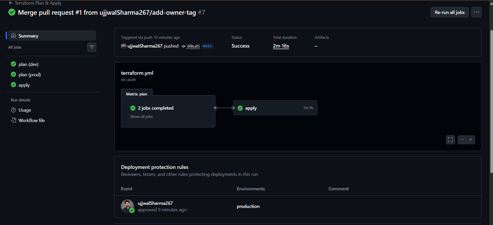

- `plan (dev)` ✅
- `plan (prod)` ✅
- Merge to `main` → `apply` job paused, waiting for approval → approved → `terraform apply -auto-approve` ran against `environments/prod` → **succeeded in 1m 9s**

Verified prod deployed for real:
```bash
cd environments/prod
terraform init
terraform state list
terraform output
```
```
module.app_bucket.aws_s3_bucket.this
module.app_bucket.aws_s3_bucket_public_access_block.this
... (18 resources total)
bucket_id = "prod-infra-app-artifacts-601226954823"
vpc_id = "vpc-0f8876f20e032b131"
web_ip = "10.10.0.254"
```

---

## Part 13 — Proof / Screenshots

| Screenshot | What it proves |
|---|---|
| 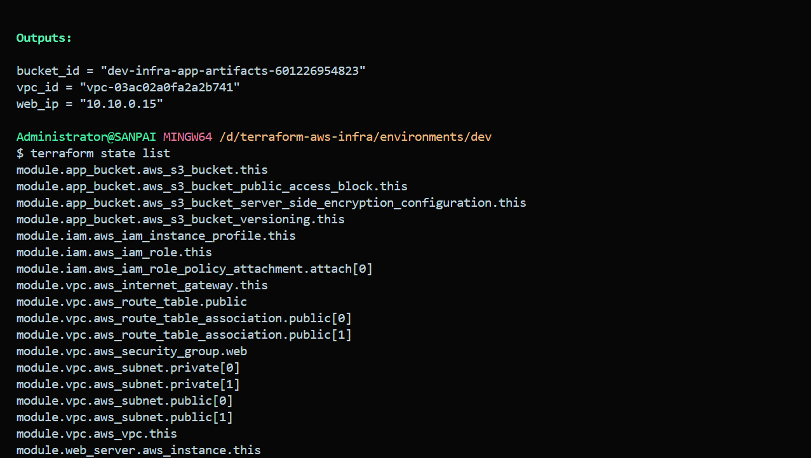 | Full `terraform state list` — all 18 resources tracked, organized by module |
| 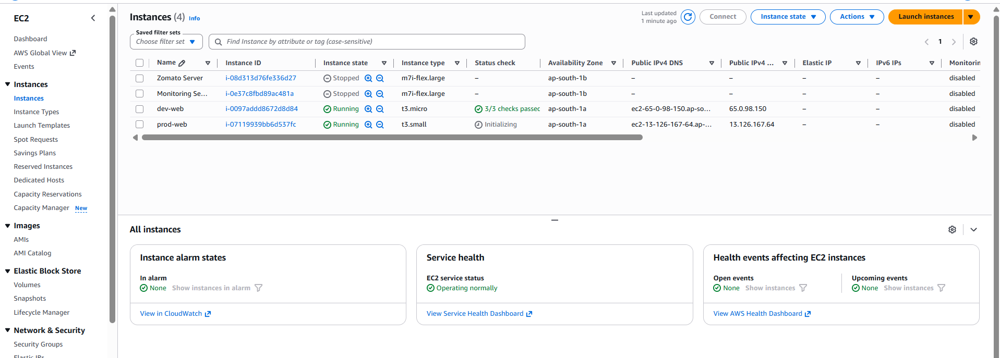 | `dev-web` and `prod-web` running side by side — real environment separation |
| 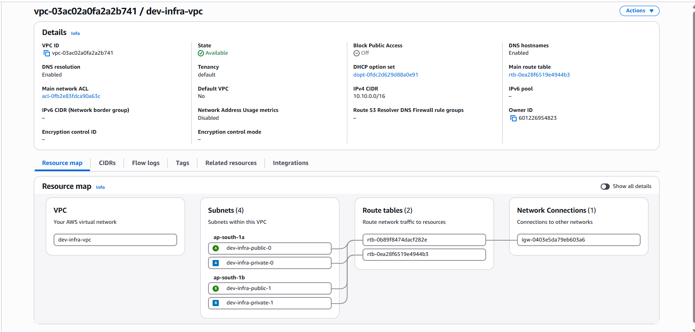 | `dev-infra-vpc` resource map — 4 subnets across 2 AZs, route tables, IGW |
| 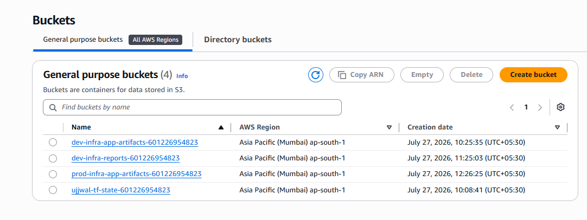 | All 4 buckets — state, dev artifacts, prod artifacts, CFN reports |
| 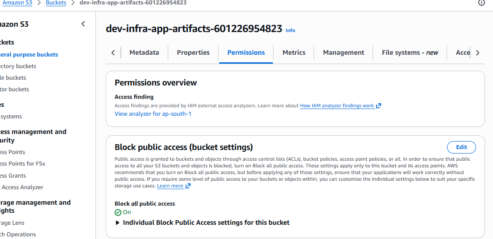 | Public access blocked on the app bucket |
|  | Both CloudWatch alarms healthy (`OK`) |
|  | CloudFormation stack `CREATE_COMPLETE` |
|  | GitHub `production` environment with required reviewers configured |
|  | Full pipeline green: `plan (dev)`, `plan (prod)`, `apply`, with approval recorded |
| 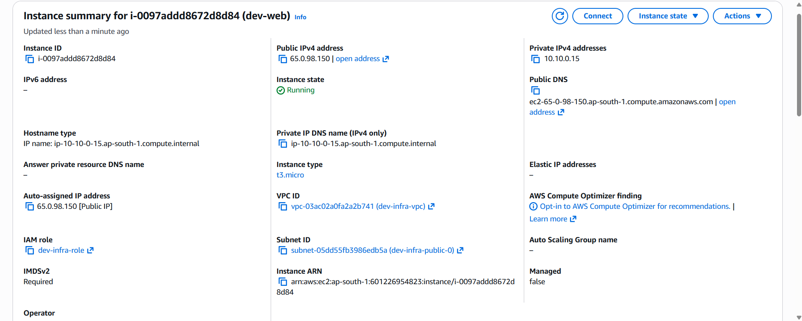 | Instance detail — private IP, IAM role, subnet, IMDSv2 required |

---

## Part 14 — Full Teardown (Zero Cost)

Order matters: Terraform-managed resources first, then CloudFormation, then the state backend itself (must go last since Terraform needs it while destroying).

### 14.1 Empty buckets first (Terraform can't delete non-empty buckets)
```bash
aws s3 rm s3://dev-infra-app-artifacts-601226954823 --recursive
aws s3 rm s3://prod-infra-app-artifacts-601226954823 --recursive
aws s3 rm s3://dev-infra-reports-601226954823 --recursive
```

### 14.2 Destroy prod
```bash
cd environments/prod
terraform destroy
```
```
Destroy complete! Resources: 18 destroyed.
```

### 14.3 Destroy dev
```bash
cd ../dev
terraform destroy
```
```
Destroy complete! Resources: 21 destroyed.
```
(21, not 18 — dev had the extra SNS topic + 2 CloudWatch alarms from Part 5.)

### 14.4 Delete the CloudFormation stack
```bash
aws cloudformation delete-stack --stack-name dev-infra-reporting --region ap-south-1
aws cloudformation describe-stacks --stack-name dev-infra-reporting --region ap-south-1 --query "Stacks[0].StackStatus" --output text
```

### 14.5 Empty and delete the state bucket (versioned buckets need special handling)
```bash
aws s3 rb s3://ujjwal-tf-state-601226954823 --force
```
First attempt failed:
```
remove_bucket failed: An error occurred (BucketNotEmpty) when calling the DeleteBucket operation:
The bucket you tried to delete is not empty. You must delete all versions in the bucket.
```
**Root cause:** versioning was enabled on this bucket, so historical object versions and delete-markers still counted as content even after "current" objects were removed.

**Fix:**
```bash
aws s3api delete-objects --bucket ujjwal-tf-state-601226954823 \
  --delete "$(aws s3api list-object-versions --bucket ujjwal-tf-state-601226954823 --output json --query '{Objects: Versions[].{Key:Key,VersionId:VersionId}}')"

aws s3api delete-objects --bucket ujjwal-tf-state-601226954823 \
  --delete "$(aws s3api list-object-versions --bucket ujjwal-tf-state-601226954823 --output json --query '{Objects: DeleteMarkers[].{Key:Key,VersionId:VersionId}}')"

aws s3api list-object-versions --bucket ujjwal-tf-state-601226954823 --output json --query "[length(Versions[] || \`[]\`), length(DeleteMarkers[] || \`[]\`)]"
```
```
[0, 0]
```
```bash
aws s3 rb s3://ujjwal-tf-state-601226954823
```

### 14.6 Delete the DynamoDB lock table
```bash
aws dynamodb delete-table --table-name terraform-locks --region ap-south-1
```

### 14.7 Final zero-cost sweep
```bash
aws ec2 describe-instances --region ap-south-1 --filters "Name=instance-state-name,Values=running,stopped" --query "Reservations[].Instances[].[InstanceId,Tags[?Key=='Name'].Value|[0],State.Name]" --output table
aws s3 ls
aws dynamodb list-tables --region ap-south-1
aws cloudformation list-stacks --region ap-south-1 --stack-status-filter CREATE_COMPLETE UPDATE_COMPLETE --query "StackSummaries[].StackName"
```

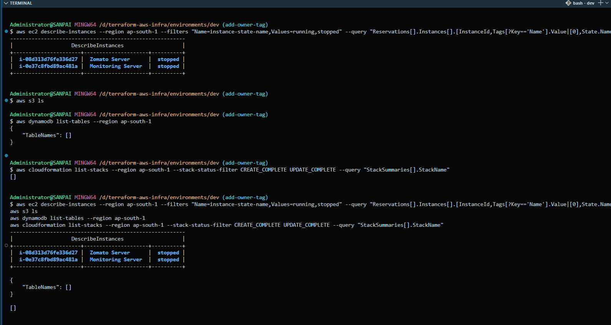

Result: **zero project resources remaining** — only two pre-existing, unrelated instances (`Zomato Server`, `Monitoring Server`, both stopped, outside this project's scope) show up. Empty S3 bucket list, empty DynamoDB table list, empty CloudFormation stack list for this project.

---

## Interview Talking Points

**"Walk me through this project"**
> "I built a reusable Terraform module library — VPC, EC2, IAM, S3, CloudWatch — consumed by separate dev and prod environments with independent state files. Remote state is in S3 with DynamoDB locking. A GitHub Actions pipeline plans on every PR across both environments and only applies to prod behind a manual approval gate, authenticated via OIDC with no static AWS keys."

**"Tell me about a bug you had to debug"**
> "My GitHub Actions OIDC role kept failing to assume with 'not authorized', even though the trust policy looked correct on paper. I added a debug step to decode the actual JWT claims GitHub was sending, and found GitHub appends immutable account/repo database IDs to the `sub` claim — like `repo:owner@12345/repo@67890:pull_request` instead of the plain `owner/repo` format most examples assume. I fixed it by combining a wildcarded `sub` match with an exact-match `repository` condition, which AWS actually requires you to include alongside `sub` — you can't drop `sub` entirely."

**"How would you scope down the IAM permissions?"**
> Currently uses `AdministratorAccess` for velocity during initial build. Next step: generate an IAM policy from CloudTrail access-advisor data after a few apply cycles, and replace the broad policy with a scoped one covering only `ec2:*`, `iam:PassRole` for the specific instance profile, `s3:*` on project-prefixed buckets, and `cloudwatch:PutMetricAlarm`/`sns:CreateTopic`.

**"How do you know this doesn't cost money right now?"**
> Full teardown was run and verified — `terraform destroy` on both environments, the CloudFormation stack deleted, the S3 state bucket emptied (including versioned objects and delete markers) and removed, and the DynamoDB lock table dropped. Final sweep confirmed zero project resources remain.

---

## How to Redeploy From Scratch (Quick Reference)

If everything's been torn down and you need it back (e.g. night before an interview):

```bash
# 1. Recreate state backend
aws s3api create-bucket --bucket ujjwal-tf-state-601226954823 --region ap-south-1 --create-bucket-configuration LocationConstraint=ap-south-1
aws s3api put-bucket-versioning --bucket ujjwal-tf-state-601226954823 --versioning-configuration Status=Enabled
aws dynamodb create-table --table-name terraform-locks --attribute-definitions AttributeName=LockID,AttributeType=S --key-schema AttributeName=LockID,KeyType=HASH --billing-mode PAY_PER_REQUEST --region ap-south-1

# 2. Verify AMI still current (AMIs deprecate over time - re-check!)
aws ec2 describe-images --owners amazon --filters "Name=name,Values=al2023-ami-*-x86_64" "Name=state,Values=available" --region ap-south-1 --query "sort_by(Images, &CreationDate)[-1].[ImageId,Name]" --output text
# update environments/*/main.tf ami_id if it changed

# 3. Deploy dev
cd environments/dev && terraform init && terraform apply -auto-approve

# 4. Deploy prod (same, or push through the CI pipeline for the full demo)
cd ../prod && terraform init && terraform apply -auto-approve

# 5. Recreate the CloudFormation stack
aws cloudformation create-stack --stack-name dev-infra-reporting --template-body file://cloudformation/reporting-bucket.yaml --parameters ParameterKey=EnvironmentName,ParameterValue=dev --region ap-south-1

# 6. Re-run the reporting script to confirm posture
python scripts/infra_report.py --region ap-south-1
```

**IAM OIDC role and GitHub environment settings persist** (they weren't destroyed) — the CI/CD pipeline will work immediately on the next push/PR without any re-setup, as long as the AWS account and GitHub repo are unchanged.

**Remember to destroy again afterward** — see [Part 14](#part-14--full-teardown-zero-cost).
