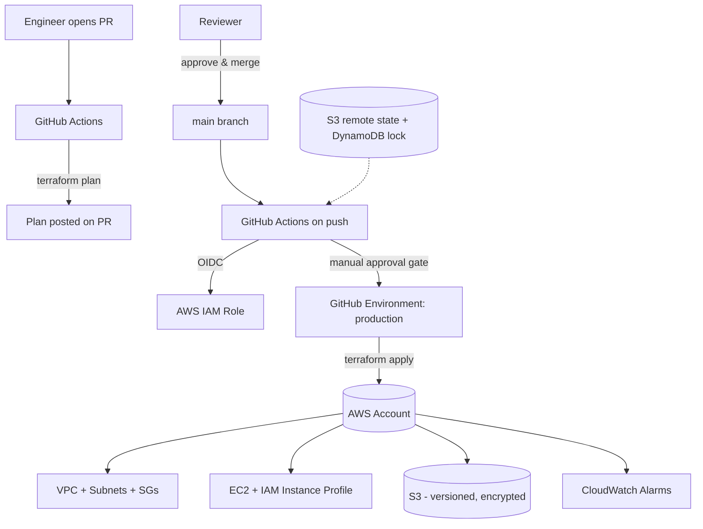

# Architecture — AWS Infrastructure Automation with Terraform

## Diagram

## Design decisions
- **Remote state with locking**: S3 backend + DynamoDB lock table prevents two people/pipelines running `apply` concurrently and corrupting state.
- **Environment isolation**: `environments/dev` and `environments/prod` are separate root modules with separate state files, both consuming the same versioned modules — same code, different inputs, no copy-paste drift.
- **Reusable modules**: `vpc`, `ec2`, `iam`, `s3`, `cloudwatch` are generic and parameterized, so a new environment is a new `environments/<name>/main.tf`, not new module code.
- **Least privilege by default**: S3 buckets block all public access and are encrypted at rest; EC2 uses IMDSv2 only; IAM roles are scoped per-purpose rather than one broad role.
- **CI/CD gate for infra changes**: `plan` runs on every PR (visible before merge); `apply` only runs on `main` and behind a GitHub Environment manual-approval gate for prod — mirrors a real CAB-style change control process.
- **No static AWS keys in CI**: GitHub Actions assumes an IAM role via OIDC (`aws-actions/configure-aws-credentials`), so there are no long-lived secrets to leak or rotate.
